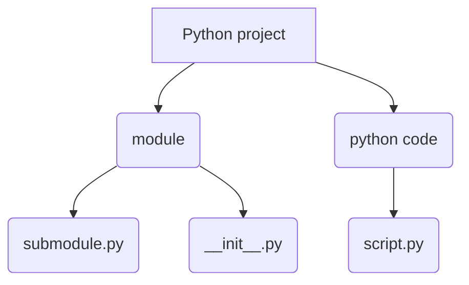

---
layout: post
title: Python Module Tips
subtitle:
date: 2019-01-15
published: True
tags:
  - Python
  - Python Module
---
#  Build In Modules
## sorted 字典
[Blog Ref](https://blog.csdn.net/tangtanghao511/article/details/47810729)

## get unique value from list of list 
```python
a  = [
    [1, 2],
    [1, 2]
]
set(a)
# TypeError: unhashable type: 'list'

# 解决办法
# 转化为tuple，tuple是hashable的
a  = [
    [1, 2],
    [1, 2]
]
set(
 tuple(value) for value in 
)
```
## numpy list +, list +的不同
```
a = np.array([1, 2])
b = np.array([2, 3])
a+ b
# np.array([3, 5])
a = [1, 2]
b = [2, 3]
a + b
# [1, 2, 2, 3]

```

## import 问题 
在python项目中会出现包的引用问题， 如下为代码结构

script.py 中代码如下才能引用submodule中函数
```
import sys
sys.path.append('../)
from src.module1 import submodule
```
然而以上代码只能在python project/python code/ 目录中执行，如果在其他目录解决办法如下：


```
import os
# 获取文件所在路径
ROOT_DIR = os.path.abspath(os.path.dirname(__file__))
# 修改路径到目标路径
os.chdir(ROOT_DIR)

import sys
sys.path.append('../)
from src.module1 import submodule
```
# Third Party Modules
## logging
### basicConfig
1. [format detail information](https://docs.python.org/3/library/logging.html#logrecord-attributes)

## os 模块

### os.path.join() 在windows和linux上的不同
**结论**: **os.path.join() 中的 argument 都不要以“/”开头**

```
cwd = os.getcwd()
# 'D:\\code\\winner'
os.path.join(cwd, 'engine')
# 'D:\\code\\winner\\engine' 可以使用
os.path.join(cwd, '/engine')
# 'D:/engine'  无法使用
os.path.join(cwd, "/engine/test")
#  'D:/engine/test' 无法使用
os.path.join(cwd, "engine/test")
# 'D:\\code\\winner\\engine/test' 可以使用
os.path.join(cwd, "engine", "test")
# 'D:\\code\\winner\\engine\\test' 可以正常使用
os.path.joi、n(cwd, "engine", "/test")
#  'D:/test' 无法正常使用
```
### Abstract path
os返回当前文件夹的绝对路径(python 项目中可用)
ROOT_DIR = os.path.abspath(os.path.dirname(__file__))


## pandas
csv 分割符的问题： "\x01" 标识crt+A, 无法代码输入。不容易造成数据读取错误


## impyla
对于python3， 下面impala_config 中port需要是int
```
from impala.dbapi import connect
from impala.util import as_pandas
import pandas as pd

impala_config = {
    "host": "10.21.130.61",
    "port": 21050,
    "user": "hdfs",
    "auth_mechanism": "GSSAPI",
    "kerberos_service_name": 'impala'
}

hive_config = {
    "host": "10.21.130.61",
    "port": 10000,
    "user": "hdfs",
    "auth_mechanism": "GSSAPI",
    "kerberos_service_name": 'hive'
}


def impala_query(sql):
    conn = connect(**impala_config)
    cur = conn.cursor()
    cur.execute(sql)
    df = as_pandas(cur)
    conn.close()
    return df


def impala_exec(sql):
    conn = connect(**impala_config)
    cur = conn.cursor()
    cur.execute(sql)
    conn.close()


def hive_query(sql):
    conn = connect(**hive_config)
    cur = conn.cursor()
    cur.execute(sql)
    data = cur.fetchall()
    conn.close()
    return pd.DataFrame(data)


def hive_exec(sql):
    conn = connect(**hive_config)
    cur = conn.cursor()
    cur.execute(sql)
    conn.close()
```
对于

## scipy
### 拟合高斯曲线，得到mu, std

```
import numpy as np
from scipy.stats import norm
import matplotlib.pyplot as plt

# Data
y = np.array([395.27, 399.77, 436.10, 486.60, 561.20, 636.37, 784.90, 917.50, 965.53, 910.87, 897.67, 868.17, 762.93, 647.33, 519.37, 426.73, 375.87])
x = np.array([0,1,2,3,4,5,6,7,8,9,10,11,12,13,14,15,16])

# Find mean and sd
mu, std = norm.fit(y)
```

## Subprocess
```
cmd=''
exit_code = subprocess.call(cmd, shell=True)
```
exit_code 如果是0则成果，大于0则失败 [链接: exit code](http://www.cnblogs.com/vamei/archive/2012/09/20/2694466.html)

## argparse
文件1中有argparse参数，如果文件2中从文件1import参数，则运行文件2的时候出错，原因不明，还需确认

 ##  opencv, plt
 
 1. plt.imsave 后的图片， cv2.imread 后像素差一个。 最好一致。
 2. opencv 图片序列和反序列化时，会对像素点进行四舍五入，如果图片已经归一化，然后进行序列化和反序列化的话，信息会丢失 cv2.imencode,   cv2.imdecode  
 
 ## datetime
1. 将UTC时间转化为当地时间
```python
import pytz

local_tz = pytz.timezone('Europe/Moscow') # use your local timezone name here
# NOTE: pytz.reference.LocalTimezone() would produce wrong result here

## You could use `tzlocal` module to get local timezone on Unix and Win32
# from tzlocal import get_localzone # $ pip install tzlocal

# # get local timezone
# local_tz = get_localzone()

def utc_to_local(utc_dt):
local_dt = utc_dt.replace(tzinfo=pytz.utc).astimezone(local_tz)
return local_tz.normalize(local_dt) # .normalize might be unnecessary
```
[原始链接](https://stackoverflow.com/questions/4563272/convert-a-python-utc-datetime-to-a-local-datetime-using-only-python-standard-lib/13287083#13287083?newreg=8cc313a2daed43ed82d6900be14ee811)

1. strftime 和 strptime
总是搞混两者区别 
```python
begin = datetime.datetime.strptime(target_day_str, '%Y-%m-%d').strftime('%Y%m%d')
```

+ strptime  string读为日期
+ strftime  将日期转化为指定格式string

## matplotlib
1. savefig为输出文件为空白 [【Python】解决使用 plt.savefig 保存图片时一片空白](https://blog.csdn.net/u010099080/article/details/52912439)

## 繁体简体转换

[繁体简体转化](
https://blog.csdn.net/u012052268/article/details/77823970)


# Machine Learning Pipeline 

## 整体流程
1. 工程化 [链接](https://towardsdatascience.com/structure-and-automated-workflow-for-a-machine-learning-project-2fa30d661c1e),[cookiecutter](https://drivendata.github.io/cookiecutter-data-science/#example)
1.  pip
pip 更新版本同时要更新setup中的版本号，这样才能安装最新版。
1. sphinx 自动生成文档
[链接](https://blog.csdn.net/liqiancao/article/details/65535444)


## 特征工程 
1. featuretools
[medium教程](https://towardsdatascience.com/automated-feature-engineering-in-python-99baf11cc219)

## 模型搭建
1. lightgbm
[kaggle 教程](https://www.kaggle.com/tobikaggle/humble-lightgbm-starter-with-learning-curve)